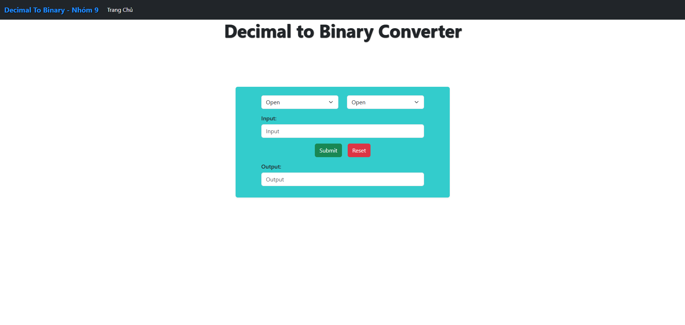

### Hệ Tính Toán Phân Bố - Apache OpenWhisk

<h6>Đây là đồ án môn học Hệ tính toán phân bố, tìm hiểu và triển khai một nền tảng serverless mã nguồn mở là Apache OpenWhisk lên một cụm cluster như K8S hoặc K3S.</h6>

### Apache OpenWhisk

Apache OpenWhisk là một nền tảng <strong>Serverless</strong> mã nguồn mở, phân tán cho phép thực thi các hàm (function) để phản hồi các sự kiện ở bất kỳ quy mô nào. <strong>OpenWhisk</strong> quản lý cơ sở hạ tầng, các máy chủ và mở rộng bằng cách using Docker container vì vậy các developer có thể chỉ cần quan tâm để việc xây dựng nên các ứng dụng hiệu quả.

<strong>OpenWhisk</strong> hỗ trợ mô hình lập trình mà ở đó các developer viết các hàm logic (gọi là các <strong>Action</strong>) bằng bất cứ ngôn ngữ lập trình nào được <strong>OpenWhisk</strong> hỗ trợ (<strong>Go, Java, NodeJS, .NET, PHP, Python, Ruby, Rust, Scala, Swift</strong>), nếu ngôn ngữ mà bạn cần hoặc các thư viện không còn hỗ trợ thì bạn có thể tạo và tùy chỉnh các tập tin thực thi của riêng mình dưới dạng Zip Actions, chạy trên môi trường Docker runtime thông qua Docker SDK. Các <strong>Action</strong> có thể được lập lịch tự động và thực thi các sự kiện kiện quan (thông qua <storng>Trigger</strong>) từ các nguồn bên ngoài (<strong>Feeds</strong>) hoặc từ các HTTP request. Dự án bao gồm giao diện (<storng>CLI</strong>) dựa trển REST API cùng với các công cụ khác để hỗ trợ đóng gói, dịch vụ danh mục và nhiều tùy chọn triển khai container phổ biến.

<strong>OpenWhisk</strong> cho phép các developer tích hợp với các <strong>Action</strong> với nhiều dịch vụ phổ biến bằng cách sử dụng các <strong>Package</strong>. Các <strong>Package</strong> cung cấp khả năng tích hợp với các dịch vụ phổ biến như <strong>Kafka</strong> message queues, cơ sở dữ liệu bao gồm <strong> Cloudant, Push Notifications</strong> từ ứng dụng di động, <strong>Slack</strong> messaging, and <strong>RSS</strong> feeds. Các quy trình phát triển (Development pipelines) có thể tận dụng việc tích hợp <strong>GitHub</strong> JIRA hoặc dễ dàng kết nối với các dịch vụ dữ liệu tùy chỉnh.

### Mô hình lập trình của OpenWhisk

<ol>
<li><strong> Actions </strong>

- <strong> Action </strong> là những hàm không trạng thái (<strong>stateless functions</strong>) chứa các ứng dụng được thực thi khi sự kiện xảy ra và các hàm này có thể viết bằng bất kỳ ngôn ngữ nào phù hợp nhu cầu.
- Các <strong> Action </strong> có thể ghép thành một chuỗi xử lý dài hơn (sequence) và có thể được dùng như một Action duy nhất.
</li>
<li> <strong>Triggers và Rules</strong>

- <strong>Trigger </strong> là các kênh sự kiện được đặt tên, dùng để nhận các loại sự kiện cụ thể từ các nguồn sự kiện.
- <strong>Rule</strong> liên kết <strong>Trigger</strong> với <strong>Action</strong>. Khi một <strong>Trigger</strong> được kích hoạt, <strong>Action</strong> tương ứng sẽ được gọi.
</li>
</ol>

### Kiến trúc của Apache OpenWhisk

  

  
  

 <ol>

<li><strong>Nginx</strong>

Là điểm đầu vào của hệ thống, nhận các HTTP Requests từ phía người dùng và chuyển tiếp chúng tới thành phần Controller. Nginx hoạt động như một reverse proxy, giúp quản lý lưu lượng và bảo mật.

</li>

<li><strong>Controller</strong>

Chịu trách nhiệm xử lý các HTTP Requests. Nó kiểm tra quyền truy cập và phân phối yêu cầu thực thi đến các thành phần bên dưới. Controller còn quản lý quá trình thực thi Actions và liên kết với các Triggers, Rules trong OpenWhisk.

<li> <strong> CouchDB </strong>

Đóng vai trò là cơ sở dữ liệu lưu trữ chính của OpenWhisk, đảm bảo dữ liệu luôn sẵn sàng và có thể truy cập. Đây là cơ sở dữ liệu NoSQL, lưu trữ các thông tin về Actions, Triggers, Rules và log của hệ thống, cho phép truy xuất và theo dõi hoạt động.

</li>

<li> <strong> Kafka </strong>

LLà message broker chịu trách nhiệm truyền tải các yêu cầu thực thi từ Controller đến Invoker. Kafka bảo đảm tính đồng bộ và khả năng xử lý song song của hệ thống khi có nhiều yêu cầu đồng thời.

</li>

<li> <strong> Invoker </strong>

Đây là thành phần thực thi các Actions. Khi nhận yêu cầu từ Kafka, Invoker sẽ tạo một container Docker (hoặc dùng lại một container hiện có) để chạy action trong môi trường cách ly. Các Invoker đảm bảo tính bảo mật và độc lập cho mỗi hàm.

</li>
 </ol>
 Ngoài ra còn có API Gateway. API Gateway cung cấp các endpoint HTTP để kích hoạt các Actions, cho phép tích hợp dễ dàng với các ứng dụng web và di động.

### Tổng quan về hệ thống hệ thống đề xuất

Nhóm triển khai một trang web có tính năng chuyển đổi các giữa các hệ thập phân,nhị phân, thập lục phân,...
Từ trang web sẽ thông qua API được tạo từ các Action của OpenWhisk để gửi request đến và nhận kết quả trả về. Như vậy OpenWhisk sẽ đóng vai trò là backend để xử lý các request của trang web thông qua API được tạo từ Action.

 

  
  

